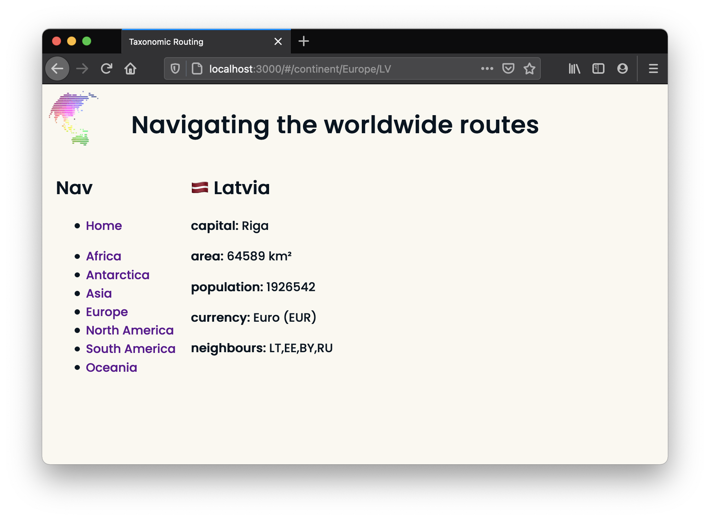
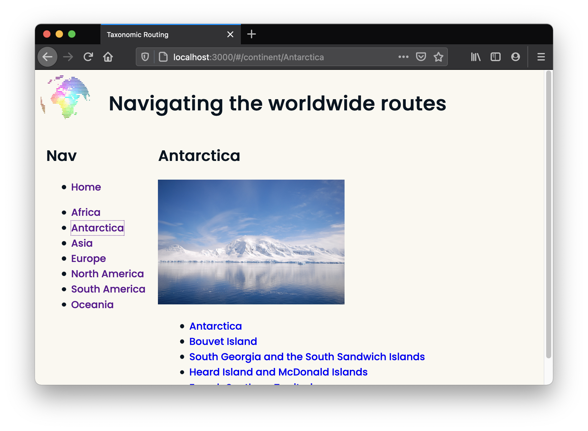

# Worldwide Routing

This exercise asks you to build an experience to navigate continents and their countries. We'll use [React Router](https://reactrouter.com/docs) to create the links and pages and manage browser history.

## Setup

### 0. Cloning and installation

- [ ] Clone this repo, navigate to it, install packages, and start the server with `npm run dev`
  <details style="padding-left: 2em">
    <summary>Tip</summary>

  ```sh
  cd worldwide-routing
  npm install
  npm run dev
  ```

  </details>

---

## Requirements

### 1. Preparing to use `<BrowserRouter>`

- [ ] Add the configuration for `BrowserRouter` in our `server.ts` (this must go AFTER the line that sets up our `public` folder)
  <details style="padding-left: 2em">
    <summary>More about configuration</summary>

  Our code will likely look like this:

  ```js
  server.get('*', (req, res) => {
    res.sendFile(join(__dirname, 'public/index.html'))
  })
  ```

  </details>

- [ ] Set up `<BrowserRouter>` in our `client/index.tsx`
  <details style="padding-left: 2em">
    <summary>More about <code>&lt;BrowserRouter&gt;</code> on the client side</summary>

  1. Import the router from `react-router-dom` at the top of the file
     ```jsx
     import { BrowserRouter as Router } from 'react-router-dom'
     ```
  2. Inside our `render()` function, we can then wrap the `<App>` component in `<Router></Router>` tags

  **Note:** We could place the router within the `<App>` instead, around specific components, but by wrapping it around `<App>` we will give everything access to the Router's functionality.

### 2. Building a Home

Check out the `App.tsx` component. It currently contains the main header, a `<Home>` component containing user instructions, and the beginnings of the `<Nav>` component.

<details>
  <summary>Image of worldwide-routing after completing this section</summary>


</details>
<br />

- [ ] Complete the `<Nav>` component so that it contains a list of continent names (like in the image) based on the information from `data/continents`. Add a list item for Home, too
  <details style="padding-left: 2em">
    <summary>Tip</summary>

  We can use `Object.keys()` on what is exported from `data/continents.ts` to get a list of continent names.
  </details>

- [ ] Import and then use the `<Routes>` and `<Route>` components from `react-router-dom`, so that the `<Home>` component will only show on `'/'`

---

### 3. Adding continents

- [ ] Add a route for `continents/:name` to our `App.tsx`. We will use it to show the selected continent and its respective image from `data/continents.ts` file

- [ ] Create a `<Continent>` component for this route, and use `useParams` (imported from `react-router-dom`) to determine which continent to show

- [ ] In the `<Continent>` component, also show a list of countries that the given continent contains

### 4. Linking it up

- [ ] In the `<Nav>` component, use the `<Link>` component from `react-router-dom` to create links for the user to navigate to continents

<details>
  <summary>Image of continent page after completing this section</summary>
    
  Notice how `<Continent>` has replaced the `<Home>` component in the image below.


</details>
<br />

---

### 5. Adding countries

Now, we'll create a component for an individual country. This is the first time we'll need to use `data/countries.ts`.

- [ ] Create a route for this page. It should look something like: `continent/:name/:code`
<details style="padding-left: 2em">
  <summary>Tip</summary>
  
  We're using the continent name and country code for this route to help us later. The url path for the above suggestion will be entered into the browser as `/continent/Oceania/NZ`.
</details>

- [ ] This route should render a `<Country>` component that shows all the information from `data/countries` for that specific country
<details style="padding-left: 2em">
  <summary>Tip</summary>
  
  The flag emoji icons don't work in all browsers (e.g. in Windows they seem to work in Firefox but not Chrome). If you see `NZ` instead of the NZ flag, try a different browser.
</details>

- [ ] Go back to the `<Continent>` component and enable each country in the list to link to the page we've just created (remember that `<Link>` component)

<details>
  <summary>Images of worldwide-routing after completing this section</summary>




</details>
<br />

### 6. Adding neighbours

Currently each country just shows a string of its neighbours' country codes.

- [ ] Create a list that will show each neighbour's **name** instead and be a link to that country's page so we can visit the pages of neighbours easily
  <details style="padding-left: 2em">
    <summary>Tips</summary>

  - Some countries have no neighbours, for example New Zealand. Consider how you handle that case
  - Some countries have neighbours that are not on the same continent, for example, Panama or Turkey. This may factor into how you build this feature
  </details>

<details>
  <summary>Image of country page after completing this section</summary>


</details>

---

## Stretch

<details>
  <summary>More about stretch challenges</summary>

- If you haven't already, add a "Home" link in the `<Nav>` component

- Bold the selected continent in the `<Nav>` when viewing a continent or country and/or change the bullet point style (as shown in the section 6 screenshot) so users will know where they are

- Countries currently show up in the order decided by the data files. Add a feature to show them alphabetically or perhaps even by population

- Read about React Router's [Nested Routes](https://reactrouter.com/docs/en/v6/getting-started/tutorial#nested-routes) and [Index Routes](https://reactrouter.com/docs/en/v6/getting-started/tutorial#index-routes). Pull the common elements from `<App />` (i.e. the heading and the `<Nav />`) and to a new component named `<Main />`, try nesting the routes for `<Home>`, `<Continent>` and `<Country>` in `<Main />`. The `<Home>` component should render on the index route, i.e. when the URL is just `http://localhost:3000/`.

</details>

---

[Provide feedback on this repo](https://docs.google.com/forms/d/e/1FAIpQLSfw4FGdWkLwMLlUaNQ8FtP2CTJdGDUv6Xoxrh19zIrJSkvT4Q/viewform?usp=pp_url&entry.1958421517=worldwide-routing)
