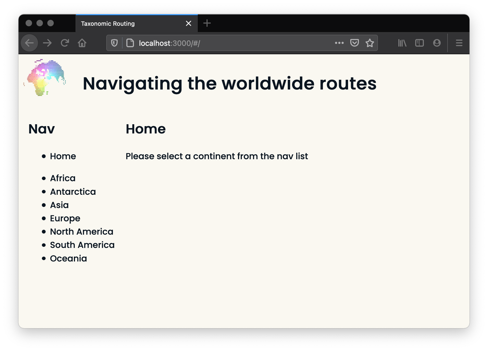
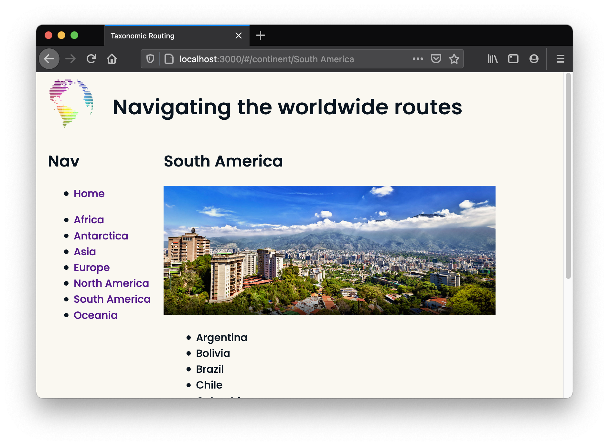
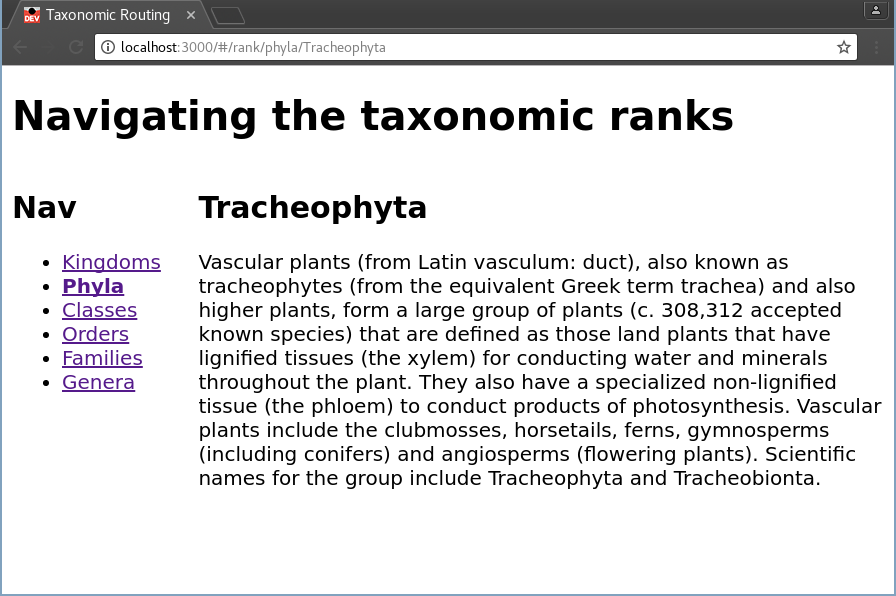
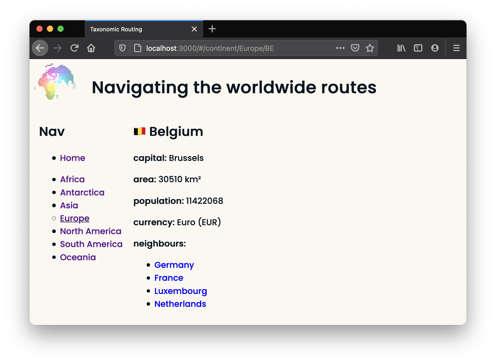
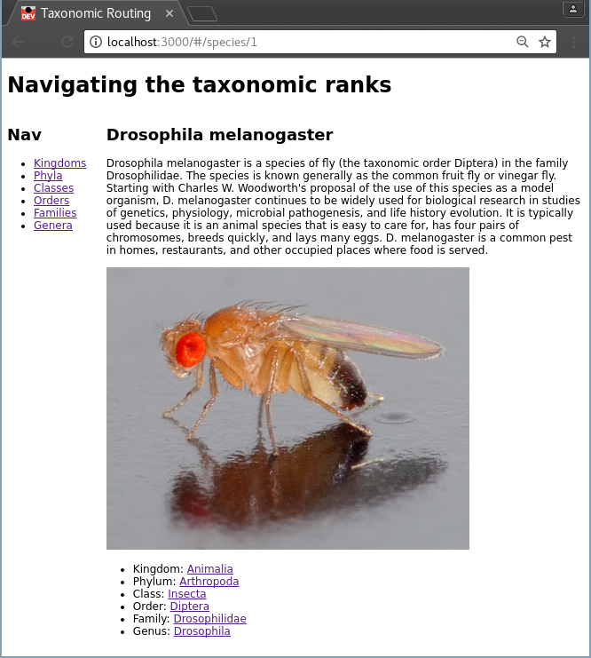

# Taxonomic Routing

This exercise has you building an experience to navigate some of the [Taxonomic Rank](https://en.wikipedia.org/wiki/Taxonomic_rank). We'll use [React Router](https://github.com/ReactTraining/react-router) to create the links and pages and manage browser history.


## Setup

After cloning this repo:

```sh
npm install
npm run dev
```


## Release 1

Try starting with a couple of components that make up a home page. In the following image, the main header is in an `App` component, the left navigation is in a `Nav` component and the instructions are in a `Home` component. All of these are shown on the `/` route as you can see in the browser's address bar.



Tip: _You can use `Object.keys()` on what is exported from `data/ranks.js` to get a list of rank names for the `Nav` component._

Note: _If you want to capitalise names, you'll need to write a `capitalise` function and call it when you need it. Perhaps skip it for now and come back to it later._


## Release 2

Next, add a route for `/list/:rank` that shows the available classifications for the selected rank. Notice how the classification listing replaced the `Home` component.



Note: _Don't worry about bolding the selected rank for the moment. You can come back and do it later._


## Release 3

When you select a classification, navigate to `/rank/:rank/:name`. It should show a component that shows the `name` and `description` of the classification.




## Release 4

In this release, add a ```<Link to={`${props.match.url}/species`}>Show species</Link>``` and a `SpeciesListing` component that shows all species in the selected classification. This is the first time you'll need to use `data/species.js`.



Tip: _You'll have to think a little about how to filter the species to just the ones that match the selected classification._


## Release 5

Create a new `/species/:id` route that uses a new `Species` component to show the `name`, `description`, `photo` and classifications of the species. Link each of the classifications to the routes you've already created.




## Future Releases

Here are some ideas for future releases:

* Add a _Home_ link in the `Nav` component.
* Bold the selected rank as shown in the release 2 screenshot.
* Capitalise the rank and classification names.
* Think about a different way you could navigate around this data and implement it in a different branch.

